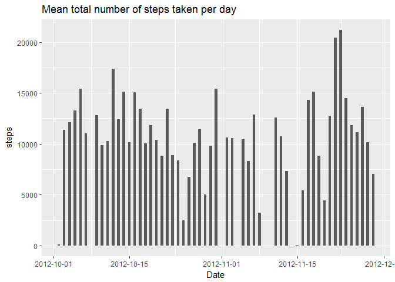
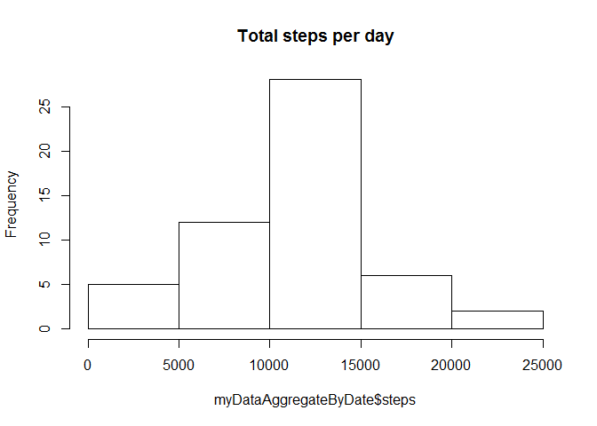
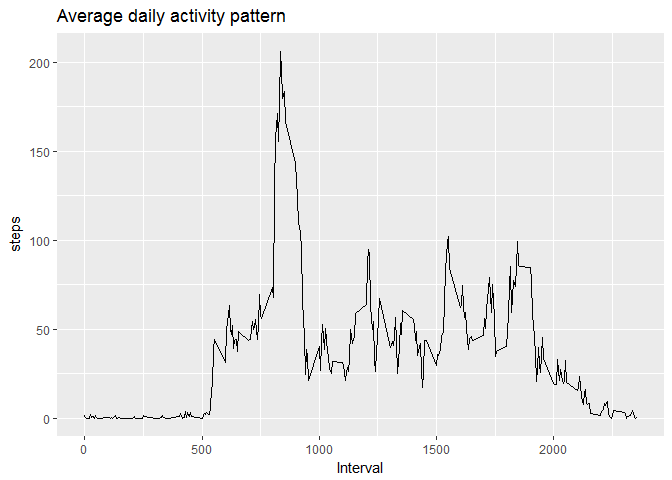
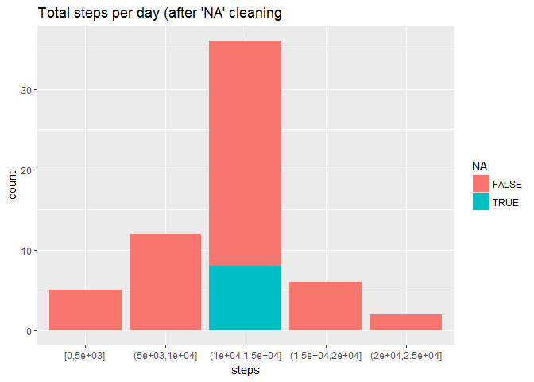
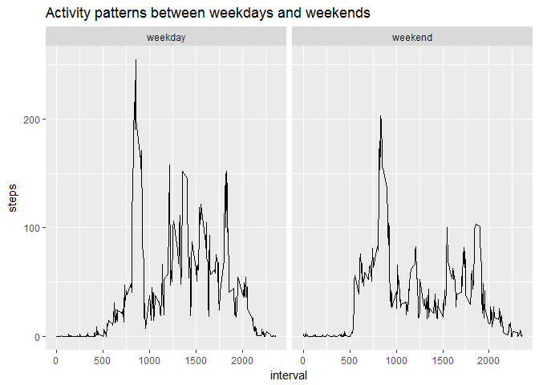

Loading and preprocessing the data
----------------------------------

It is now possible to collect a large amount of data about personal movement using activity monitoring devices such as a Fitbit, Nike Fuelband, or Jawbone Up. These type of devices are part of the "quantified self" movement - a group of enthusiasts who take measurements about themselves regularly to improve their health, to find patterns in their behavior, or because they are tech geeks. But these data remain under-utilized both because the raw data are hard to obtain and there is a lack of statistical methods and software for processing and interpreting the data.

Data comes from a personal activity monitoring device. This device collects data at 5 minute intervals through out the day. The data consists of two months of data from an anonymous individual collected during the months of October and November, 2012 and include the number of steps taken in 5 minute intervals each day.

Forst of all, we load the packages required for our analysis, we load and unzip the data and we inspect the data set by checking the summary and the first rows:

``` r
library(dplyr)
library(plotly)
library(ggplot2)
library(Hmisc)

unzipped <- unzip("activity.zip", overwrite = TRUE )
myData <- read.csv("activity.csv", header = TRUE, sep = ",", na.strings = c("NA", "NaN" ,""));
summary(myData)
```

    ##      steps                date          interval     
    ##  Min.   :  0.00   2012-10-01:  288   Min.   :   0.0  
    ##  1st Qu.:  0.00   2012-10-02:  288   1st Qu.: 588.8  
    ##  Median :  0.00   2012-10-03:  288   Median :1177.5  
    ##  Mean   : 37.38   2012-10-04:  288   Mean   :1177.5  
    ##  3rd Qu.: 12.00   2012-10-05:  288   3rd Qu.:1766.2  
    ##  Max.   :806.00   2012-10-06:  288   Max.   :2355.0  
    ##  NA's   :2304     (Other)   :15840

``` r
head(myData)
```

    ##   steps       date interval
    ## 1    NA 2012-10-01        0
    ## 2    NA 2012-10-01        5
    ## 3    NA 2012-10-01       10
    ## 4    NA 2012-10-01       15
    ## 5    NA 2012-10-01       20
    ## 6    NA 2012-10-01       25

What is mean total number of steps taken per day?
-------------------------------------------------

We calculate the total number of steps taken per day by summing for each day the number of the steps for all intervals and then we plot the total number:

``` r
myDataAggregateByDate <- aggregate( steps ~ date, myData, sum) 

# the following lines could be used to show the aggregated data set
# summary(myDataAggregateByDate)
# head(myDataAggregateByDate)

ggplot( myDataAggregateByDate, aes(x = as.Date(date), y = steps )) + 
  geom_bar(stat= "identity", width = .5) + xlab("Date") +
  scale_x_date(date_labels = "%Y-%m-%d") + ggtitle("Mean total number of steps taken per day")
```



We notice by looking at the bar plot that for some days no data are available. We now plot the following histogram where the frequency of days for number of steps is shown:

``` r
hist(myDataAggregateByDate$steps, breaks=6,  main = "Total steps per day")
```



Most of the days, around 10000-15000 steps have been taken.

We now calculate and report the mean and median of the total number of steps taken per day:

``` r
mean( myDataAggregateByDate$steps, na.rm = TRUE )
```

    ## [1] 10766.19

``` r
median( myDataAggregateByDate$steps, na.rm = TRUE )
```

    ## [1] 10765

The mean of steps taken per day is 10766.19 and the median is 10765.

What is the average daily activity pattern?
-------------------------------------------

We now plot a time series: 5-minute interval (x-axis) and the average number of steps taken, averaged across all days (y-axis)

``` r
myDataAggregateByInterval <- aggregate( steps ~ interval, myData, mean)
# head( myDataAggregateByInterval )
ggplot( myDataAggregateByInterval, aes(x = interval, y = steps )) + 
  xlab("Interval") + geom_line() + ggtitle("Average daily activity pattern")
```



Imputing missing values
-----------------------

As previously remarked, the data set contains some "NA" value. The purpose is now cleaning the data set by removing the invalid values. We start by checking which row contains an invalid value:

``` r
indx <- apply(myData, 1, function(x) any(is.na(x) ))
summary(indx)
```

    ##    Mode   FALSE    TRUE    NA's 
    ## logical   15264    2304       0

The number of rows with 'NA' steps is 2304. We substitute those 'NA' values with the mean of the corresponding time interval computed on the entire data set and we re-calculate the mean and the median on the new data set:

``` r
newdata <- merge(myData[indx,], myDataAggregateByInterval, by=c("interval"));
newdata <- newdata[,c("steps.y", "date", "interval" )];

myData[indx,] <- newdata;

colNamesData <- colnames(myData);

myData$indx <- as.factor(indx);

levels( myData$indx ) <- c("Input data", "Original data")
colnames(myData) <- c(colNamesData,"NA");

myNewDataByDate <- aggregate( steps ~ date + indx, myData, sum) 

mean( myNewDataByDate$steps, na.rm = TRUE )
```

    ## [1] 10766.19

``` r
median( myNewDataByDate$steps, na.rm = TRUE )
```

    ## [1] 10766.19

As shown, our choice to fill the 'NA values' modified the mean and the median values. We now investigate how the new data impact the total number of step we analysed at the beginning.

``` r
myNewDataByDate$steps <- cut(myNewDataByDate$steps, breaks=c(0, 5000, 10000, 15000, 20000, 25000), include.lowest=TRUE)
qplot(factor(steps), data=myNewDataByDate, geom="bar", fill=indx)  +
  xlab("steps") + labs(fill="NA")  + ggtitle("Total steps per day (after 'NA' cleaning") 
```



Even if mean and median have slightly changed, the shape of the distribution has not changed.

Are there differences in activity patterns between weekdays and weekends?
-------------------------------------------------------------------------

We now focus on comparing the activities during the weekends and during thge week days. To achieve that, we add a new column containing the distinction between the two categories, and we use the aggregate function and ggplot to show the two trends:

``` r
myData["weekday"] <- as.factor( as.POSIXlt(as.Date(myData$date))$wday < 5 );
levels( myData$weekday ) <- c("weekday", "weekend")

myDataAggregateByInterval <- aggregate( steps ~ interval + weekday, myData, mean)

# we can check the first rows of the new aggregate data set
# ( myDataAggregateByInterval )

ggplot( myDataAggregateByInterval, aes(x = interval, y = steps )) +
  facet_grid( ~ weekday ) + geom_line()  + ggtitle("Activity patterns between weekdays and weekends") 
```



The step activity trends are different between weekends and working days. This may be due to people having more time for activity and less work hours during the week end.
